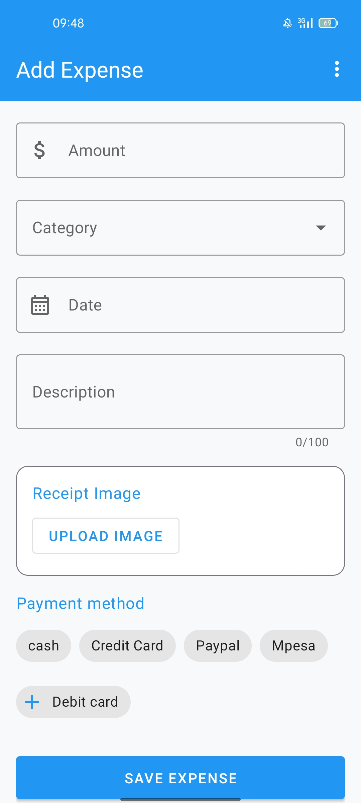
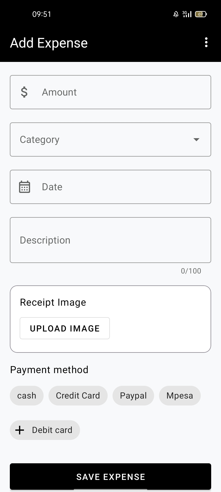
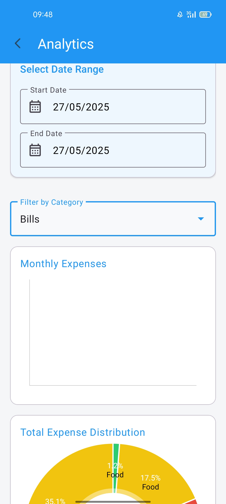
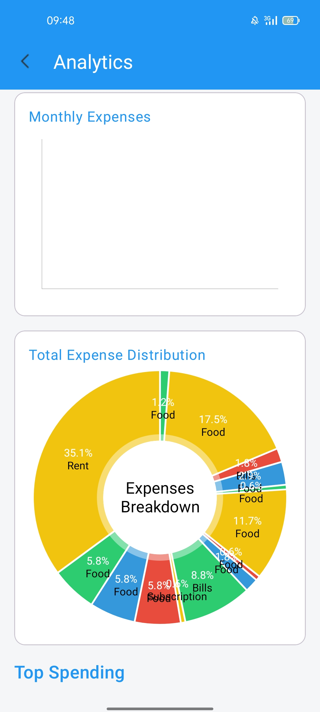
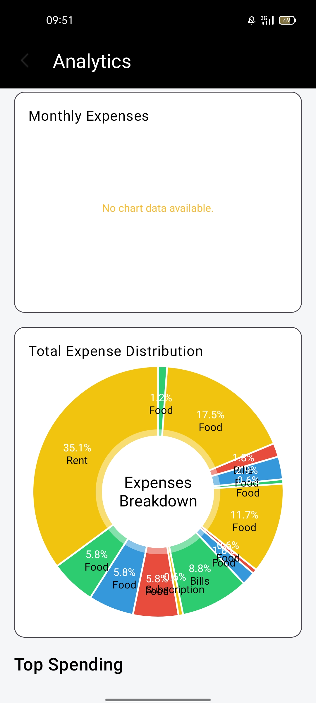
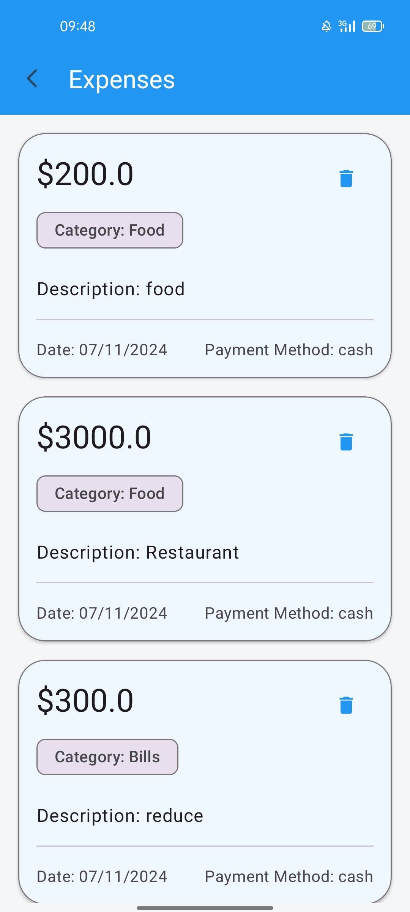
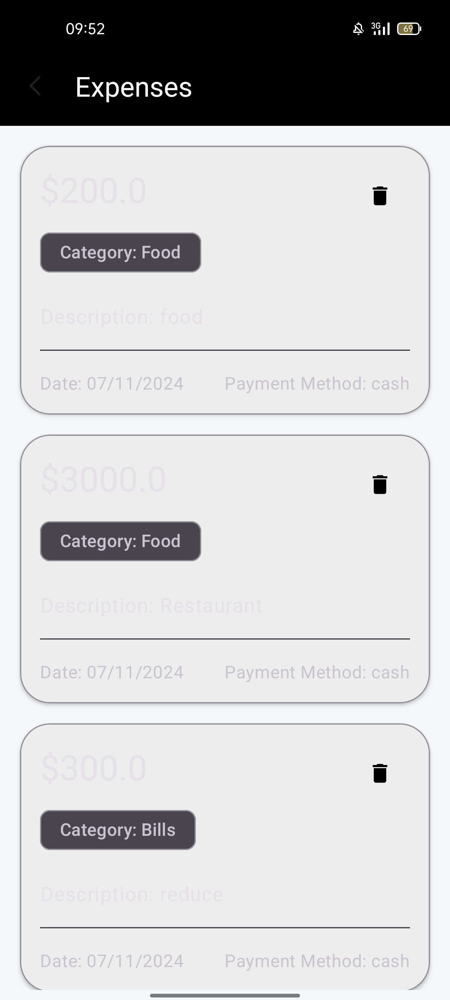

## ExpenseTracker
An Android application  that allows users to record their daily spending. And visualizes the spending in a graphical chart.
          
Built with kotlin.

## screenshot
 

  

 

  

## Releases 

Download the APK from [AppStoreGallery][https://appgallery.huawei.com/app/C113467943]

# Set up Requirements
1. Android studio
2. Physical device / emulator 

## Build and Run ExpenseTracker
1. Clone the repository.

2. Open the project in Android Studio.

3. Sync the Gradle files and run the app module.

## 🔧  Built with

- **Language:** Kotlin
- **Architecture:** MVVM (Model-View-ViewModel)
- **UI Framework:**  XML + Material Design
- **Asynchronous Tasks:** Kotlin Coroutines
- **Navigation:** Navigation Component
- **Libraries** MPAndroidChart
- **Persistence** Room Database

## 🚀 Features

- **Add & Manage Expenses**  
  Record daily expenses with amount, category, date, and  notes.

- **Visual Expense Reports**  
  Generate insightful pie and bar charts for monthly and category-wise analysis using **MPAndroidChart**.

- **Categorization of Expenses**  
  Organize expenses into custom or predefined categories for better financial tracking.

- **Real-time UI Updates with LiveData**  
  Dynamic and responsive UI updates powered by **LiveData** in the MVVM architecture.

- **Local Data Storage with ROOM**  
  Store and manage your data securely on the device using **ROOM** database.

- **Clean MVVM Architecture**  
  Follows the **Model-View-ViewModel (MVVM)** pattern for a scalable and maintainable codebase.

- **Filter & Search Transactions**  
  Easily locate transactions with built-in filter and search functionality.

- **Material Design UI**  
  Modern and user-friendly interface using Google's **Material Design** components.

- **Published on Huawei AppGallery**  
  Officially available on the **Huawei Developer Console**:  
  [https://appgallery.huawei.com/app/C113467943](https://appgallery.huawei.com/app/C113467943)

##  Contributing
Contributions are welcome! Feel free to fork the repo, open issues, and submit pull requests